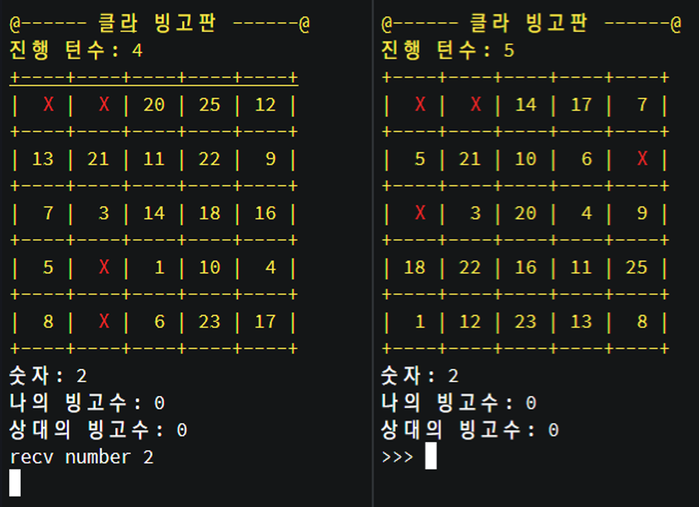
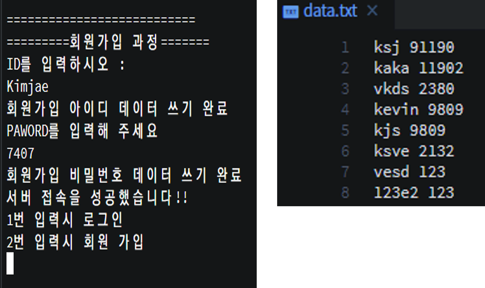

# TCP 프로그래밍을 이용한 빙고 게임 

<center>
  
</center>


## 서버 환경 

- 리눅스 ( 우분투 18.04.0 LTS )
- 발표시에는 포트 포워딩을 이용하여 [groom](https://edu.goorm.io/)에 서버를 올려 외부에서 빙고게임 서버에 접속 가능하게 했습니다.
- 테스트시 여러 터미널을 띄우고 게임을 플레이 했습니다. 

## 설계 내용(프로그램 설명)

### 구성 

- bingo_server.c, bingo_client.c

### 사용법

- 서버 
```bash
>cd ./src
>make 
gcc  bingo_client.c -o bingo_client -lpthread
gcc  bingo_server.c -o bingo_server -lpthread
>./bingo_server [PORT] 
```
- 클라이언트 
```bash
>./bingo_client [IP] [포트] 
```

### 구동방식
- 서버는 2명의 사용자가 접속 할 때 마다 게임 방을 생성
- 플레이어들은 2명씩 나뉘어 게임을 진행
- 게임을 진행하며 채팅 가능
<br/>

### 게임 규칙

- 1:1 대결이며 서로 차례를 두고 먼저 5빙고를 달성한 플레이어가 승리하며 게임 종료
- 빙고판은 5X5 칸으로 생성되고 1~25 사이의 숫자로 랜덤 배치
- 같은 턴에 5 빙고를 달성할 시 무승부 처리
<br/>

### 프로그램 흐름도

  


### 클라이언트 설계 

  

- 동일 아이디 접속 불가 
- 회원 가입을 통한 아이디 접속 
- data.txt에 기록 

### 서버 설계 
<br/>
  

- 사용자가 들어오면 상대방을 만날때 까지 매칭을 기다린다.
- 각 방은 자식 프로세스를 만들어서 들어온 사용자 2명의 네트웍 버퍼를 넘겨준다. 
- 이로써 서버에 각 게임 방과 연관없이 구동할 수 있다. 
- 매칭된 플레이어는 숫자를 이용하여 빙고 게임을 하거나 채팅을 칠 수 있다. 

## 파일 구조 
---

```bash
	TCP/src/hedwig/
		> bingo_server.c  # 서버 파일
		> bingo_client.c  # 클라 파일
		> Makefile        # make , make clean
		> data.txt        # login data
```

### **data.txt**

 

사용자의 ID 와 PWD를 저장하는 텍스트 파일  
### **Makefile**

```bash
> make # 실행 파일 생성 
> make clean # 파일 제거 
```

	
## 결론 

>멀티 쓰레드와 멀티 프로세스를 활용하여 서버를 구축하며, 쓰레드와 멀티 프로세스를 사용하고 분배하는 방안을 익힐 수 있었다.

>클라이언트간 통신을 위해 정해진 구조체와 문법을 사용하여, 통신하는 방법에 대해 자세히 익힐 수 있었다.

>좀비 프로세스와 강제종료로 인한 예상치 못한 상황을 대처하기 위해 시그널을 이용하여, 이러한 문제들을 적절히 처리하고 대비하는 방법을 연습할 수 있었다.

